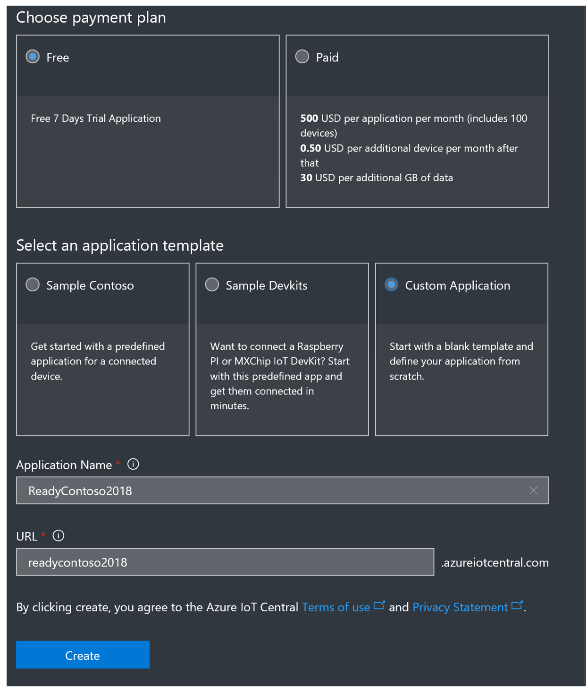
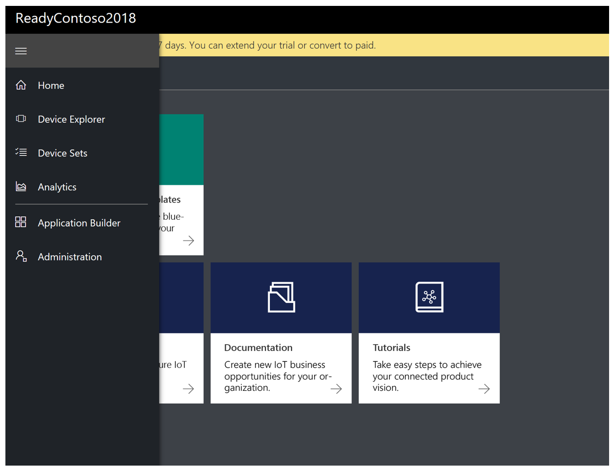
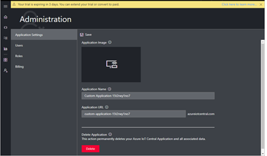
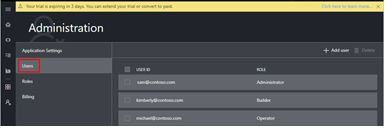
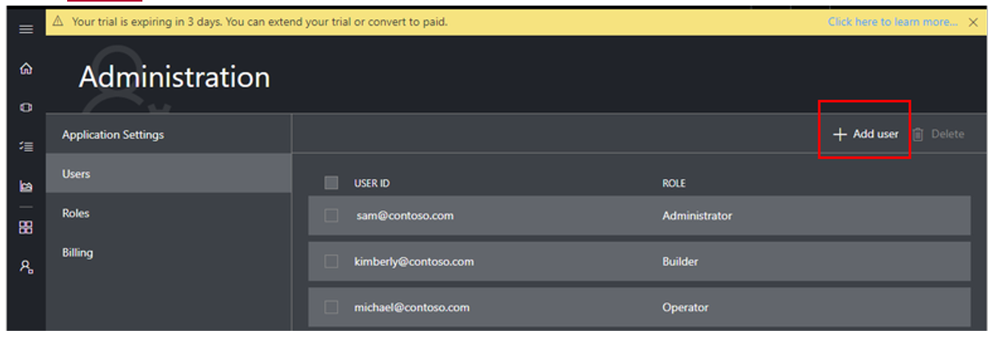
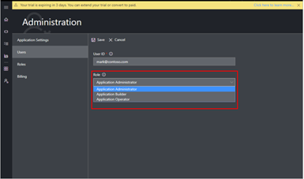
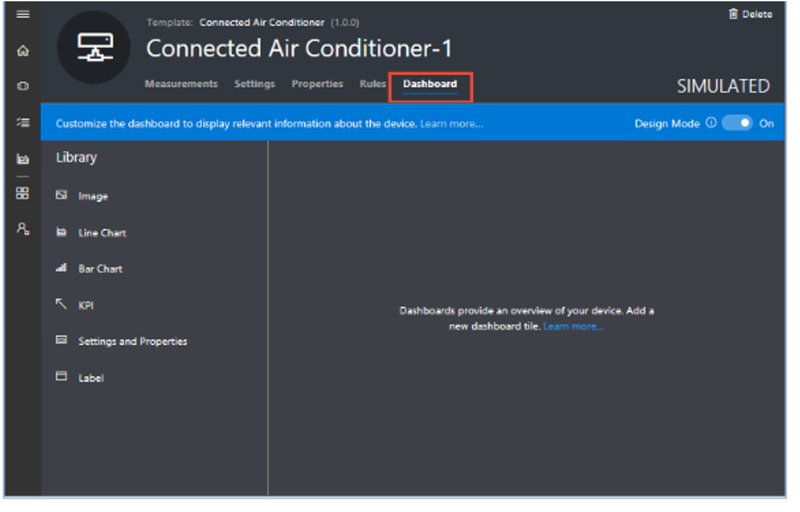
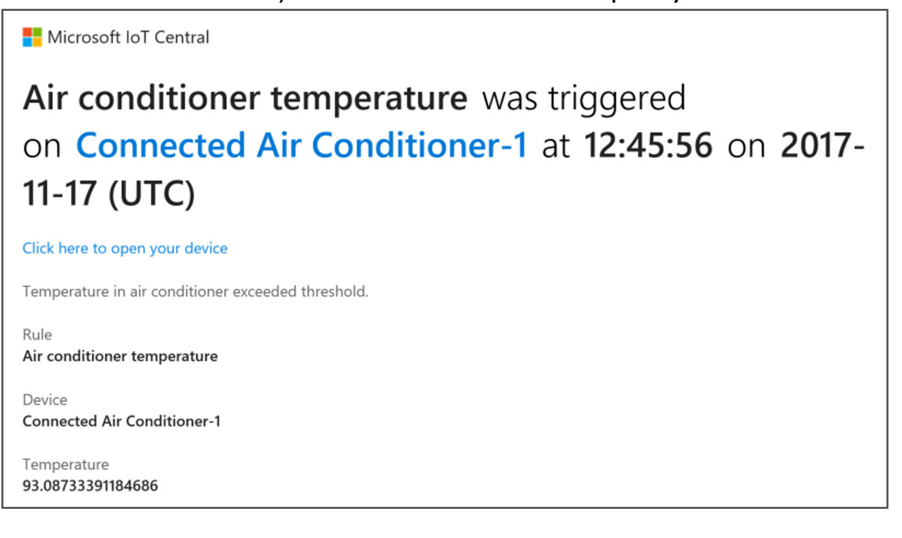

# DAI-DP 302 Experience the simplicity of SaaS for IoT (Internet of Things) with IoT Central 

Experience the simplicity of SaaS for IoT (Internet of Things), with no cloud expertise required—Azure IoT Central is a fully managed global IoT SaaS (software-as-a-service) solution that makes it easy to connect, monitor, and manage your IoT assets at scale. Bring your connected products to market faster while staying focused on your customers.

* Simplify setting up your IoT solution 
* Connect and manage your things with ease
* Rest easy with world-class security and privacy

<iframe src="https://channel9.msdn.com/Shows/Internet-of-Things-Show/Connect-real-devices-to-Microsoft-IoT-Central/player" width="960" height="540" allowFullScreen frameBorder="0"></iframe>

## Scenario

Contoso company have Connected Air Conditioner and their goal is:

* Sends telemetry such as temperature.
* Reports state such as whether it is on or off.
* Has properties such as its firmware version and serial number.
* Has settings such as its target temperature and fan speed.

In this workshop, you will learn how to build, use and administer an IoT Central application through the perspective of each of these personas.


## Administrator

### Create an application

Create your Microsoft [Azure IoT Central application](https://apps.azureiotcentral.com/create) from the **Create Application** page. To create an Azure IoT Central application, you must complete all the fields on this page as below and then choose click the **Create** button.

For the purposes of this workshop:

* You’ll get an authentication prompt when you the click the link to the IoT Central application creation page.
* Log-in using your Microsoft Account (MSA) or your Microsoft corporate account (AAD) when you get an authentication prompt.
* You must complete all the fields on this page as below and then click the “Create” button. Choose the following values for each of the fields:
* Payment plan = “Free”
* Template = “Custom Application”
* You can choose a Name and URL of your choice.



>Note: For more information Regarding each of these fields, please click on this link:
https://docs.microsoft.com/en-us/azure/iot-central/howto-create-application

### Administer Your Application

Navigate to the Administration section by choosing Administration on the left navigation menu.



The Administration section enables you to:

* Manage users
* Manage roles
* View billing information
* Manage application settings
* Extend a free trial



Now we are going to add users as **Operators** and **Builders**

1. To add a user account to an Azure IoT Central application, use the secondary navigation menu to navigate to the Users page in the Administration section



2. On the Users page, choose “Add User” to add a user.



3. When you add a user to your Azure IoT Central application, choose a role for the user from the Role drop-down. Learn more about roles in the Roles in Azure IoT Central section of this article



>Note: To add users in bulk, enter the User IDs of all the users you'd like to add separated by semi-colons. Choose a role from the Role drop-down and choose Save.

4. After you add a user, an entry appears for that user on the Users page


>Note: Edit the roles assigned to users. Roles cannot be changed once assigned. To change the role assigned to a user, delete the user and add the user again with a different role.

## Builder

In this section we will learn how to:

* Create a new device template
* Add telemetry to your device
* View simulated telemetry
* Define event measurement
* View simulated events
* Define state measurement
* View simulated state
* Use device properties
* Use device settings

## Create a new custom device template

As a builder, you can create and edit the device templates in your application. When you create a device template, Azure IoT Central generates a simulated device from the template. The simulated device generates telemetry that enables you to test the behavior of your application before you connect a physical device.

To add a new device template to your application, you need to go to the Application Builder page.


The following steps show you how to create a new Connected Air Conditioner device template for devices that send temperature telemetry to your application.:

1. On the Application Builder page, choose Create Device Template:


2. On the Application Builder page, choose Create Device Template:


On the Device Templates page, choose Custom. A Custom device template enables you to define all the characteristics and behaviors of your connected air conditioner


On the New Device Template page, enter Connected Air Conditioner as the name of your device, and then choose Create. You can also upload an image of your device that's visible to operators in the device explorer


In the Connected Air Conditioner device template, make sure you are on the Measurements page where you define the telemetry. Each device template you define has separate pages for you to:

* Specify the measurements, such as telemetry, event, and state, sent by the device.
* Define the settings used to control the device.
* Define the properties used to record information about the device.
* Define the rules associated with the device.
* Customize the device dashboard for your operators.


>Note: To change the name of the device or device template, click on the text at the top of the page.

To add the temperature telemetry measurement, choose New Measurement. Then choose Telemetry as the measurement type.


Each type of telemetry you define for a device template includes [configuration options](https://docs.microsoft.com/en-us/azure/iot-central/howto-set-up-template) such as:

* Display options.
* Details of the telemetry.
* Simulation parameters.

To configure your Temperature telemetry, use the information in the following table:


You can also choose a color for the telemetry display. To save the telemetry definition, choose **Save**.


After a short while, the Measurements page shows a chart of the temperature telemetry from your simulated connected air conditioner device. Use the controls to manage visibility, aggregation, or to edit the telemetry definition.


You can also customize the chart using the Line, Stacked, and Edit Time Range controls.


### Define Event measurement

You can use Event to define point-in-time data that is sent by the device to signify something of significance like an error or a component failure. Like telemetry measurements, Azure IoT Central can simulate device events to enable you to test the behavior of your application before you connect a physical device. You define event measurements for your device type in the Measurements view.
To add the Fan Motor Error event measurement, choose New Measurement. Then choose Event as the measurement type.


Each type of Event you define for a device template includes [configuration options](https://docs.microsoft.com/en-us/azure/iot-central/howto-set-up-template) such as:

* Display Name.
* Field Name.
* Severity.

To configure your Fan Motor Error event, use the information in the following table:


To save the event definition, choose **Save**


After a short while, the Measurements page shows a chart of the events randomly generated from your simulated connected air conditioner device. Use the controls to manage visibility, or to edit the event definition.


To see additional details about the event, click the event on the chart.


### Define State measurement

You can use State to define and visualize the state of the device or its component over a period of time. Like telemetry measurements, Azure IoT Central can simulate device state to enable you to test the behavior of your application before you connect a physical device. You define state measurements for your device type in the Measurements view.

To add Fan Mode measurement, choose New Measurement. Then choose State as the measurement type.


Each type of State you define for a device template includes [configuration options](https://docs.microsoft.com/en-us/azure/iot-central/howto-set-up-template) such as:

* Display Name.
* Field Name.
* Values with optional display labels.
* Color for each value

To configure your Fan Mode state, use the information in the following table:


To save the state measurement definition, choose **Save**.


After a short while, the Measurements page shows a chart of the states randomly generated from your simulated connected air conditioner device. Use the controls to manage visibility, or to edit the state definition.


In case, there are too many data points sent by the device within a small duration, the state measurement is shown with a different visual as shown below. If you click on the chart, then all the data points within that time- period are displayed in a chronological order. You can also narrow down the time range so see the measurement plotted on the chart.


### Properties, device properties, and settings

Properties, device properties, and settings are different values defined in a device template and associated with each individual device:

* You use settings to send configuration data to a device from your application. For example, an operator could use a setting to change the device's telemetry interval from two seconds to five seconds. When an operator changes a setting, the setting is marked as pending in the UI until the device acknowledges that it has actioned the setting change.
* You use properties to record information about your device in your application. For example, you can use properties to record a device's serial number or the device manufacturer's phone number. Properties are stored in the application and do not synchronize with the device. An operator can assign values to properties.
* You use device properties to enable a device to send property values to your application. These properties can only be changed by the device. For an operator, device properties are read-only.

### Use settings

You use settings to enable an operator to send configuration data to a device. In this section, you add a setting to your Connected Air Conditioner device template that enables an operator to set the target temperature of the connected air conditioner. 
Navigate to the Settings page for your Connected Air Conditioner device template.:

>Note: if the Design Mode is set to off, please set it to **On**.


1. You can create settings of different types such as numbers or text.
2. Choose Number to add a number setting to your device.
3. To configure your Set Temperature setting, use the information in the following table:


Then choose **Save**


>Note: When the device acknowledges a setting change, the status of the setting changes to synced.

You can customize the layout of the Settings page by moving and resizing settings tiles.


### Use properties / device properties

You use properties to store information about your device in the application. In this section, you add device properties to your Connected Air Conditioner device template to store the device serial number and firmware version. Note that both of these are read-only properties reported by the device -- you cannot assign values to them. Properties you might use that you can assign values to include the location of the device, ownership information, and the last service date/time for the device.

Navigate to the Properties page for your Connected Air Conditioner device template.


1. You can create device properties of different types such as numbers or text. To add a serial number property to your device template, choose Text.

2. To configure your serial number property, use the information in the following table


Leave other fields with their default values.


1. Choose **Save**.
2. To add a firmware version to the device properties for your device template, choose Text.
3. To configure your firmware version device property, use the information in the following table:


Choose **Save**.

You can customize the layout of the Properties page by moving and resizing property tiles.


### Use commands 

You use commands to enable an operator to run commands directly on the device. In this section, you add a command to your Connected Air Conditioner device template that enables an operator to echo a certain message on the the connected air conditioner display (this works with MxChip sample code).

1. Navigate to the Commands page for your Connected Air Conditioner device template.:


You can create commands of different types based on your requirements.

2. Click New Command to add a command to your device.
3. To configure your new command, use the information in the following table


You can add additional inputs to the command by clicking + for inputs.

Choose **Save**.

You can customize the layout of the Commands page by moving and resizing commands tile


### View your simulated device

Now you have defined your Connected Air Conditioner device template, you can customize its Dashboard to include the measurements, settings, and properties you defined. Then you can preview the dashboard as an operator.:
Choose the Dashboard page for your Connected Air Conditioner device template.



Choose Line Chart to add the component onto the Dashboard.


Configure the Line Chart component using the information in the following table


Then choose **Save**.

Configure the Event Chart component using the information in the following table


Then choose **Save**.

Configure the State Chart component using the information in the following table.


Then choose **Save**.

To add the set temperature setting to the dashboard, choose Settings and Properties


Configure the Settings and Properties component. : Choose:
1.	Set Temperature
2.	Firmware Version
3.	Serial Number


Then choose **Save**.

To view the dashboard as an operator, switch off Design Mode on the top right of the page

### Configure rules

1. To start adding a rule in the Rules view, choose Rules


2. To start creating the threshold-based telemetry rule, choose New Rule, then Telemetry.

3. To define your rule, use the information in the following table


### Add an action

When you define a rule, you also define an action to run when the rule conditions are met. In this tutorial, you add an action to send an email as a notification that the rule triggered.

1.	To add an Action, scroll down on the Configure Telemetry Rule panel and choose the + next to Actions, then choose Email


To define your action, use the information in the following table


>Note: To receive an email notification, the email address must be a [user ID in the application](https://docs.microsoft.com/en-us/azure/iot-central/howto-administer), and that user must have signed in to the application at least once.


Choose **Save**. Your rule is listed on the Rules page


Test the rule:

Shortly after you save the rule, it becomes live. When the conditions defined in the rule are met, your application sends a message to the email address you specified in the action.


### Customize the operator’s view

To edit the dashboard, choose Dashboard


To add a KPI tile to the dashboard, choose **KPI**


Choose **Save**. You can now see the KPI tile on the dashboard.


To move or resize a tile on the dashboard, move the mouse pointer over the tile. You can drag the tile to a new location or resize it.


### Configure the default home page

When a builder or operator signs in to an Azure IoT Central application, they see a home page. As a builder, you can configure the content of this home page to include the most useful and relevant content for an operator.

1.	To customize the default home page, navigate to the Home page and switch Design Mode on, on the top right of the page. Upon turning on Design Mode, a panel will slide out from the right with a list of objects you can add to your Homepage.


2. To customize the home page, add tiles from the Library. Choose Link and add details of your organization's web site. Then choose **Save**.


>Note: You can also add links to pages within your Azure IoT Central application. For example, you could add a link to a device dashboard or settings page.

3.	Optionally, choose Image and upload an image to display on your home page. An image can have a URL to which you navigate when you click on it:


To learn more, see [How to prepare and upload images to your Azure IoT Central application](https://docs.microsoft.com/en-us/azure/iot-central/howto-prepare-images).

### Preview the default home page as an operator

To preview the home page as an operator, switch Design Mode off on the top right of the page.


You can click on the link and image tiles to navigate to the URLs you set as a builder.

### Operator

#### Monitor your Devices

##### Receive a notification

Azure IoT Central sends notifications about devices as email messages. The builder added a rule to send a notification when the temperature in a connected air conditioner device exceeded a threshold. Check the emails sent to the account the builder chose to receive notifications.
Open the email message you received at the end of the [Configure rules and actions for your device](https://docs.microsoft.com/en-us/azure/iot-central/tutorial-configure-rules) tutorial. In the email, choose **Click here to open your device**.



The Device page for the Connected Air Conditioner-1 simulated device you created in the previous tutorials opens in your browser.

### Investigate an issue

As an operator, you can view information about the device on the Measurements, Settings, Properties, Rules, and Dashboard pages. The builder customized the Dashboard to display important information about a connected air conditioner device.

Choose the Dashboard view to see information about the device.


The chart on the dashboard shows a plot of the device temperature. You can also see the current target temperature for the device in the Set target temperature tile. You decide that the target temperature is too high.

### Remediate an issue

To change the target temperature of the device, use the Settings page:

1.	Choose Settings. Change Set Temperature to 100. Choose Update to send the new target temperature to the device. When the device acknowledges the settings change, the status of the setting value changes to synced.


2. Choose Dashboard and verify the new setting value.


### Add a Real Device 

To add a real device to your application, you use the Connected Air Conditioner device template you created in the [Define a new device type](https://docs.microsoft.com/en-us/azure/iot-central/tutorial-define-device-type) tutorial.

1.	To add a new device as an operator, choose Device Explorer in the left navigation menu. The Device Explorer shows the Connected Air Conditioner device template and the simulated device that was automatically created when the builder created the device template.

2.	To start connecting a real connected air conditioner device, choose New, then Real.


3. Optionally, you can rename your new device by choosing the device name and editing the value.


### Configure a real device

The real device is created from the Connected Air Conditioner device template. As a builder, you can use Settings to configure your device and set property values to record information about your device.

1.	On the Settings page, notice that the Set Temperature setting status is “no update”. It stays in this state until the real device connects and acknowledges that it has acted on the setting.


2.	On the Properties page for your new, real connected air conditioner device, set Serial Number to rcac0010, and Firmware version to 9.75. Then choose **Save**.


As a builder, you can view the Measurements, Rules, and Dashboard pages for your real device.

### Get connection string for real device from application

A device developer needs to embed the connection string for your real device in the code that runs on the device. The connection string enables the device to connect securely to your Azure IoT Central application. Every device instance has a unique connection string. The following steps show you how to find the connection string for a device instance in your application:

1.	On the Device screen for your real connected air conditioner device, choose Connect this device.


2. On the Connect page, copy the Primary connection string, and save it. You use this value in the second half of this tutorial. A device developer uses this value in the client application that runs on the device.


### Prepare the client code

The example code in this article is written in [Node.js](https://nodejs.org/) and shows just enough code to:

* Connect as a device to your Azure IoT Central application.
* Send temperature telemetry as a connected air conditioner device.
* Respond to an operator who uses the Set Temperature setting.

The "How to" articles referenced in the [Next Steps](https://docs.microsoft.com/en-us/azure/iot-central/tutorial-add-device#next-steps) section provide more complete samples and show the use of other programming languages. For more information about how devices connect to Azure IoT Central, see the [Device connectivity](https://docs.microsoft.com/en-us/azure/iot-central/concepts-connectivity) article.
The following steps show how to prepare the Node.js sample:

1.	Install [Node.js](https://nodejs.org/) version 4.0.x or later in your machine. Node.js is available for a wide variety of operating systems.
2.	Create a folder called connectedairconditioner on your machine.
3.	In your command-line environment, navigate to the connectedairconditioner folder you created.
4.	To initialize your Node.js project, run the following commands accepting all the defaults:
cmd/shCopy
npm init
5.	To install the necessary packages, run the following commands:
cmd/shCopy
npm install azure-iot-device azure-iot-device-mqtt --save
6.	Using a text editor, create a file called ConnectedAirConditioner.js in the connectedairconditioner folder.
7.	Add the following require statements at the start of the ConnectedAirConditioner.js file.
JavaScriptCopy

```nodejs
'use strict';

var clientFromConnectionString = require('azure-iot-device-mqtt').clientFromConnectionString;
var Message = require('azure-iot-device').Message;
var ConnectionString = require('azure-iot-device').ConnectionString;

```

8.	Add the following variable declarations to the file:
JavaScriptCopy

```
var connectionString = '{your device connection string}';
var targetTemperature = 0;
var client = clientFromConnectionString(connectionString);
```

>Note: You update the placeholder {your device connection string} in a later step.

9. Save the changes you have made so far but keep the file open.

### Understand how client code maps to the application

In the previous section, you created a skeleton Node.js project for an application that connects to your Azure IoT Central application. In this section, you add the code to:

* Connect to your Azure IoT Central application.
* Send telemetry to your Azure IoT Central application.
* Receive settings from your Azure IoT Central application.

1.	To send temperature telemetry to your Azure IoT Central application, add the following code to the ConnectedAirConditioner.js file:
JavaScriptCopy

```nodejs
// Send device telemetry.
function sendTelemetry() {
  var temperature = targetTemperature + (Math.random() * 15);
  var data = JSON.stringify({ temperature: temperature });
  var message = new Message(data);
  client.sendEvent(message, (err, res) => console.log(`Sent message: ${message.getData()}` +
    (err ? `; error: ${err.toString()}` : '') +
    (res ? `; status: ${res.constructor.name}` : '')));
}
```

The name of the field in the JSON you send must match the name of the field you specified for temperature telemetry in your device template. In this example, the name of the field is temperature.

2. To define the settings your device supports, such as setTemperature, add the following definition:
JavaScriptCopy

```nodejs
// Add any settings your device supports
// mapped to a function that is called when the setting is changed.
var settings = {
  'setTemperature': (newValue, callback) => {
    // Simulate the temperature setting taking two steps.
    setTimeout(() => {
      targetTemperature = targetTemperature + (newValue - targetTemperature) / 2;
      callback(targetTemperature, 'pending');
      setTimeout(() => {
        targetTemperature = newValue;
        callback(targetTemperature, 'completed');
      }, 5000);
    }, 5000);
  }
};

```

3. To handle settings sent from Azure IoT Central, add the following function that locates and executes the appropriate device code:
JavaScriptCopy

```nodejs
// Handle settings changes that come from Azure IoT Central via the device twin.
function handleSettings(twin) {
  twin.on('properties.desired', function (desiredChange) {
    for (let setting in desiredChange) {
      if (settings[setting]) {
        console.log(`Received setting: ${setting}: ${desiredChange[setting].value}`);
        settings[setting](desiredChange[setting].value, (newValue, status, message) => {
          var patch = {
            [setting]: {
              value: newValue,
              status: status,
              desiredVersion: desiredChange.$version,
              message: message
            }
          }
          twin.properties.reported.update(patch, (err) => console.log(`Sent setting update for ${setting}; ` +
            (err ? `error: ${err.toString()}` : `status: success`)));
        });
      }
    }
  });
}
```

This function:

* Watches for Azure IoT Central sending a desired property.
* Locates the appropriate function to call to handle the setting change.
* Sends an acknowledgement back to your Azure IoT Central application.

4.	Add the following code to complete the connection to Azure IoT Central and hook up the functions in the client code:
JavaScriptCopy

```nodejs
// Handle device connection to Azure IoT Central.
var connectCallback = (err) => {
  if (err) {
    console.log(`Device could not connect to Azure IoT Central: ${err.toString()}`);
  } else {
    console.log('Device successfully connected to Azure IoT Central');
     // Send telemetry measurements to Azure IoT Central every 1 second.
    setInterval(sendTelemetry, 1000);
     // Get device twin from Azure IoT Central.
    client.getTwin((err, twin) => {
      if (err) {
        console.log(`Error getting device twin: ${err.toString()}`);
      } else {
        // Apply device settings and handle changes to device settings.
        handleSettings(twin);
      }
    });
  }
};

client.open(connectCallback);

```

5. Save the changes you have made so far but keep the file open.

### Configure client code for the real device

To configure your client code to connect to your Azure IoT Central application, you need to add the connection string for your real device that you noted earlier in this tutorial.

1.	In the ConnectedAirConditioner.js file, find the following line of code:
JavaScriptCopy

```
var connectionString = '{your device connection string}';
```

1.	Replace {your device connection string} with the connection string of your real device. You made a note of the connection string at the end of the "Get connection string for real device from application" section.
2.	Save the changes to the ConnectedAirConditioner.js file.
3.	To run the sample, enter the following command in your command-line environment:
cmd/shCopy
node ConnectedAirConditioner.js

>Note: Make sure you are in the connectedairconditioner folder when you run this command.
1.	The application prints output to the console:


2. After about 30 seconds, you see the telemetry on the device Measurements page.


3.	On the Settings page, you can see the setting is now synchronized. When the device first connected, it received the setting value and acknowledged the change.


4. On the Settings page, set the device temperature to 95 and choose Update device. Your sample application receives and processes this change.


>Note: There are two **setting update** messages. One when the pending status is sent and one when the completed status is sent.

5.	On the Measurements page you can see that the device is sending higher temperature values.


