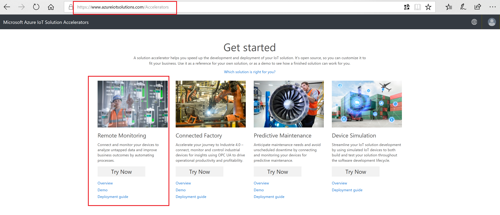
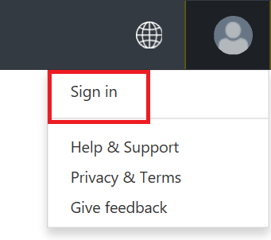
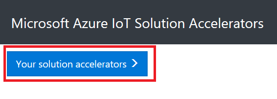
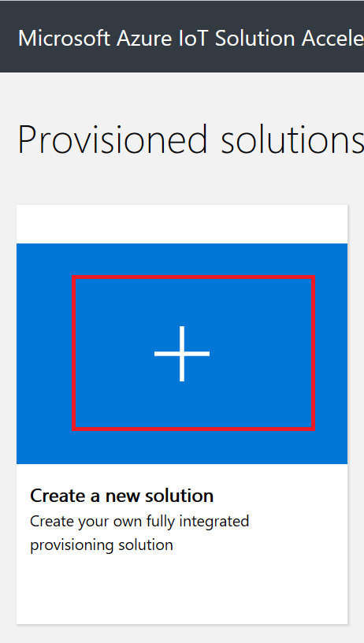
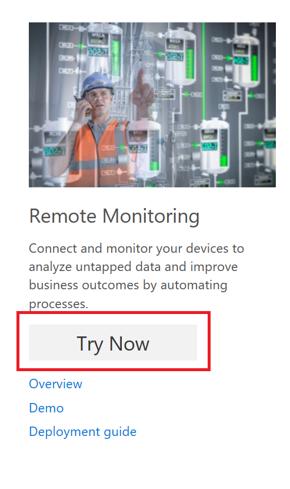

# DAI-DP 304 Azure IoT solution accelerators - Prerequisites

## Create Remote Monitoring Solution

Go To [Azure IoT Solutions Website](http://azureiotsolutions.com/). You will be creating and working with Remote Monitoring solution accelerator in this workshop.

**Sign in** to the website.

Click on **Your Solution Accelerators** button.

Click on **Your Solution Accelerators** button.

Create a new solution.

Click on **Try now** button.

Create Remote Monitoring Solution.

For this workshop select **Basic** deployment option.

You have the choice of selecting a language

1. .NET
2. Java

Provide a solution name, select your subscription and region to deploy the solution. The **Details** button will be greyed out till the provisioning is in progress.

Click **Create Solution** button.

Takes a few minutes to deploy the solution. Status of the solution creation can be seen on the website.

Click **Launch** button.

You will land on Remote Monitoring dashboard.

