# DAI-DP 302 Unlocking the IoT promise- Design and architect solutions with real-world impact


Azure IoT Hub is a fully managed service that enables reliable and secure bidirectional communications between millions of IoT devices and a solution back end. Azure IoT Hub:

* Provides multiple device-to-cloud and
* cloud-to-device communication options. These options include one-way messaging, file transfer, and request-reply methods.
* Provides built-in declarative message routing to other Azure services.
* Provides a queryable store for device metadata and synchronized state information.
* Enables secure communications and access control using per-device security keys or X.509 certificates.
* Provides extensive monitoring for device connectivity and device identity management events.
* Includes device libraries for the most popular languages and platforms.

## IoTHub: Connect, monitor, and manage billions of IoT assets

* **Establish** bi-directional communication with billions of IoT devices
* **Authenticate** per device for security-enhanced IoT solutions
* **Register** devices at scale with IoT Hub Device Provisioning Service
* **Manage** your IoT devices at scale with device management
* **Extend** the power of the cloud to your edge device

<iframe src="https://channel9.msdn.com/events/Build/2018/BRK3804/player" width="480" height="270" allowFullScreen frameBorder="0"></iframe>

### In this lab you will

* Learn to Create IoT Solution Accelerator

* Learn to use Simulator to connect to Accelerator and send Data

* Learn to setup MXChip, connect to Solution Accelerator and send data


## Create Remote Monitoring Solution

Go To [Azure IoT Solutions Website](http://azureiotsolutions.com/). You will be creating and working with Remote Monitoring solution accelerator in this workshop.


**Sign in** to the website.


Click on **Your Solution Accelerators** button.


Click on **Your Solution Accelerators** button.


Create a new solution.


Click on **Try now** button.


Create Remote Monitoring Solution.

For this workshop select **Basic** deployment option.

You have the choice of selecting a language

1. .NET
2. Java

Provide a solution name, select your subscription and region to deploy the solution. The **Details** button will be greyed out till the provisioning is in progress.

Click **Create Solution** button.

Takes a few minutes to deploy the solution. Status of the solution creation can be seen on the website.

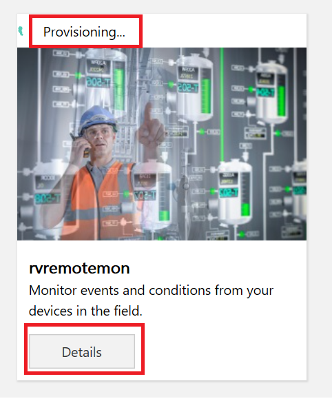


Click **Launch** button.


You will land on Remote Monitoring dashboard.


Filter to view **Chillers**

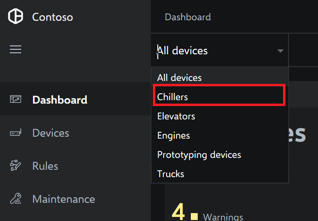

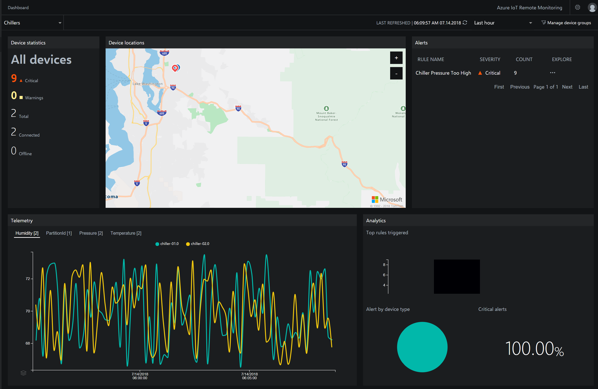

Go back to All Devices View by clicking on **All Devices** in the drop down.

Manage Device Groups

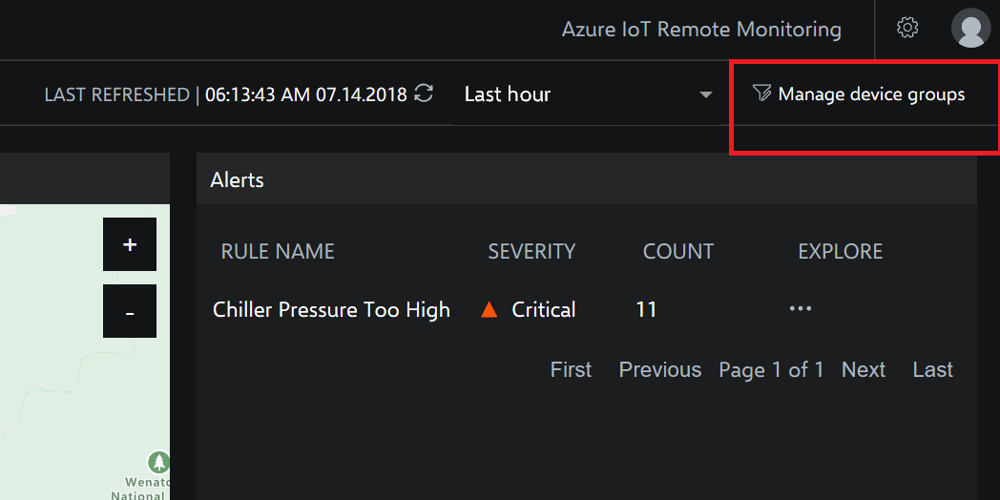

Create a new device group

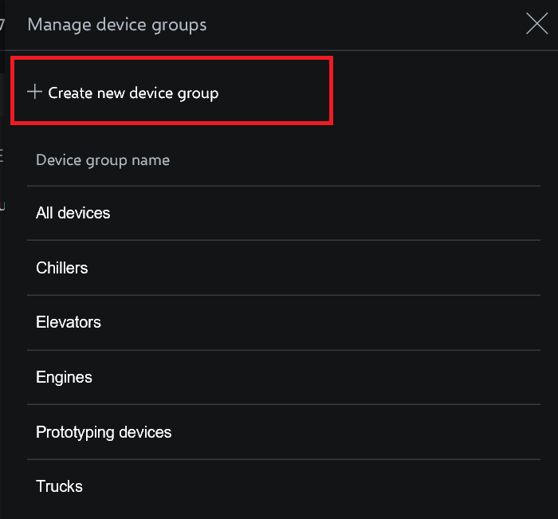

Create a new **MXChip** device group. Remove condition and click **Save**

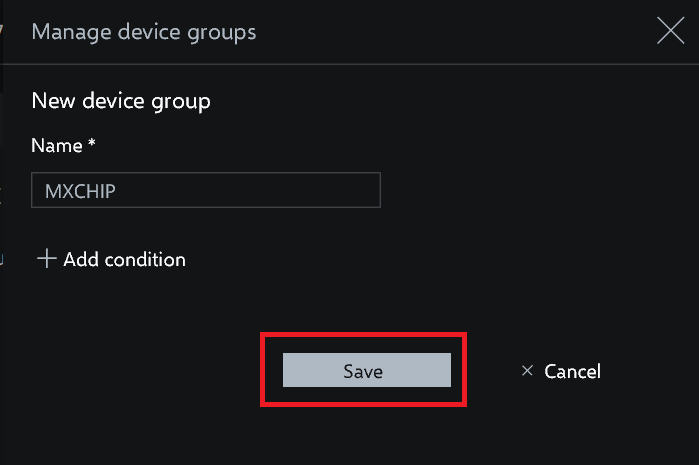

Create a new **MXChip** device group. Remove condition and click **Save**

Go To **Devices** from left menu. Click on **New Device**.

Select a **Physical** device and enter device id and click **Apply**.

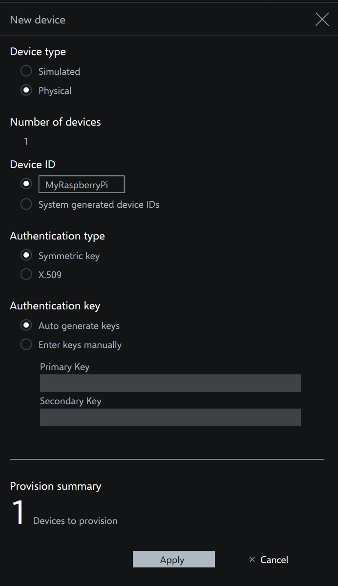

Copy the connection string primary key

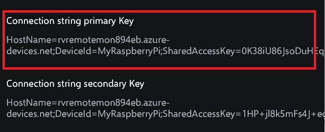

Click on the link below to go to the PI Simulator

[PI Simulator](https://azure-samples.github.io/raspberry-pi-web-simulator/#GetStarted)

Replace the connection string with the primary key connection string copied in the previous steps


After you copy the connection string should look like below


Click Run and start sending messages. LED will start blinking


Device will be in connected status in the web ui if you refresh the web page.

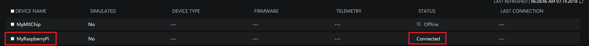

click on the device to see device details. Click on **see raw message** to see the JSON data details.

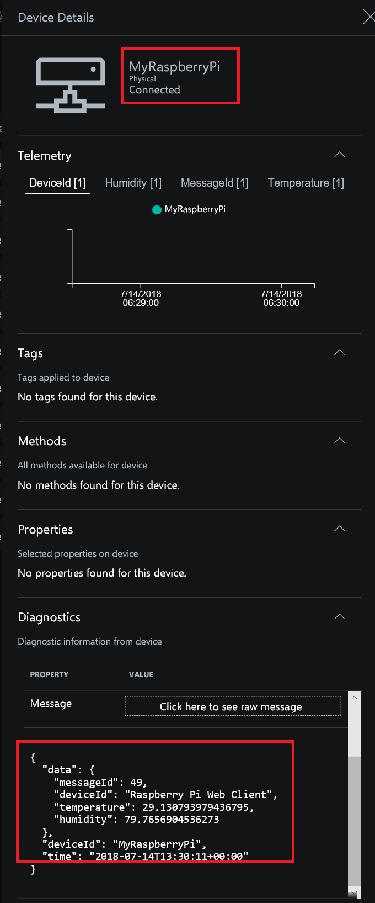

## Create Consumer Groups to Route Data

Under IoTHub, Messaging click on **Endpoints**


Click on **Events**


Create two consumer groups for

* Time Series Insights
* Stream Analytics


## Connect Device and Send Data to IoThub

This Lab assumes you are using MXChip as the Device


### Prepare the MXChip by

* updating firmware
* connecting to Wifi
* connecting to Azure to select a subscription and IoTHub
* uploading device code

[Prepare MXChip to Connect to IoTHub](https://docs.microsoft.com/en-us/azure/iot-hub/iot-hub-arduino-iot-devkit-az3166-get-started)

When doing cloud-provision select the Remote Monitoring IoT Hub to connect your MXChip

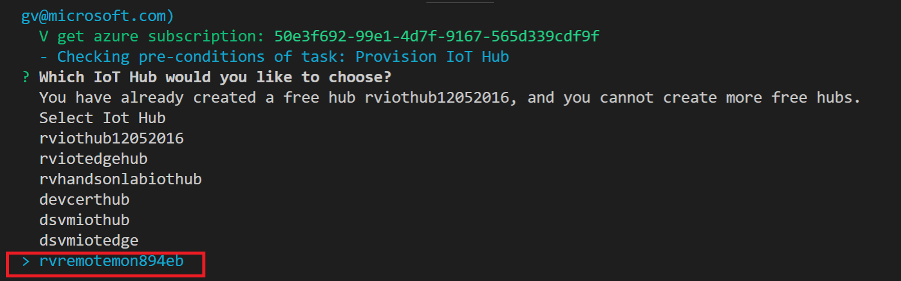

Once Device Connects to Remote monitoring solution IoT Hub you will see a new device AZ3166.

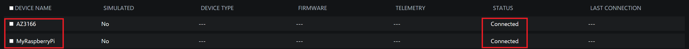

Click on the device to see device details. Click on **see raw message** to see the JSON data details.

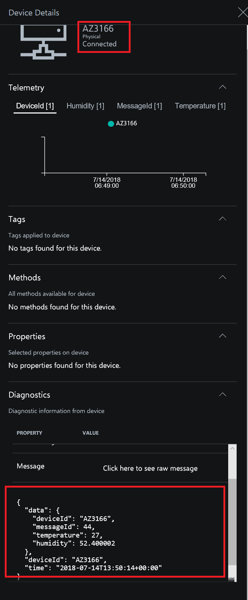

Click on **Rules** on the left menu.

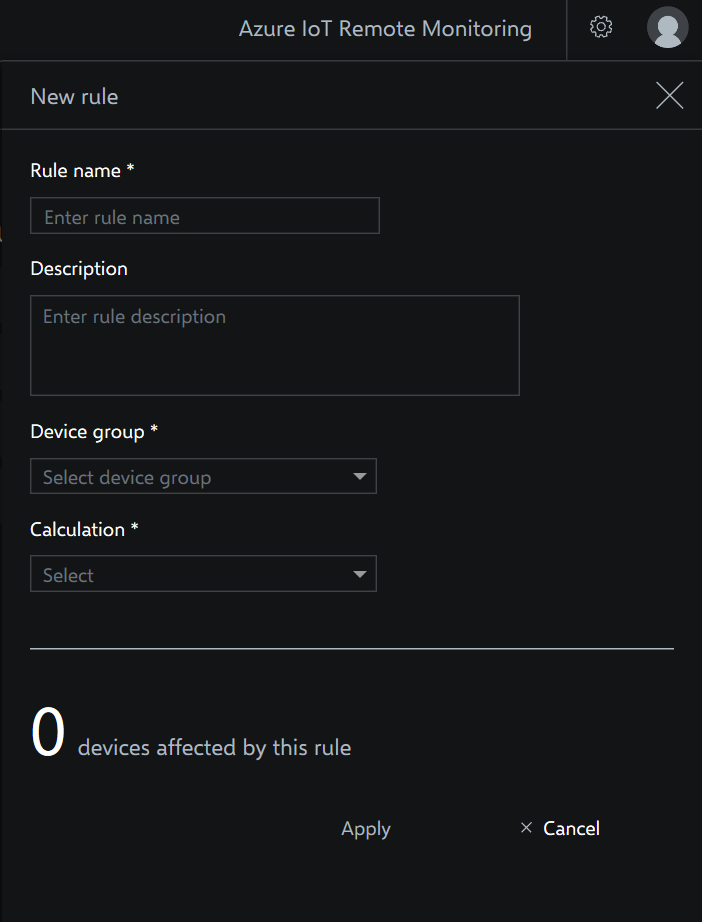

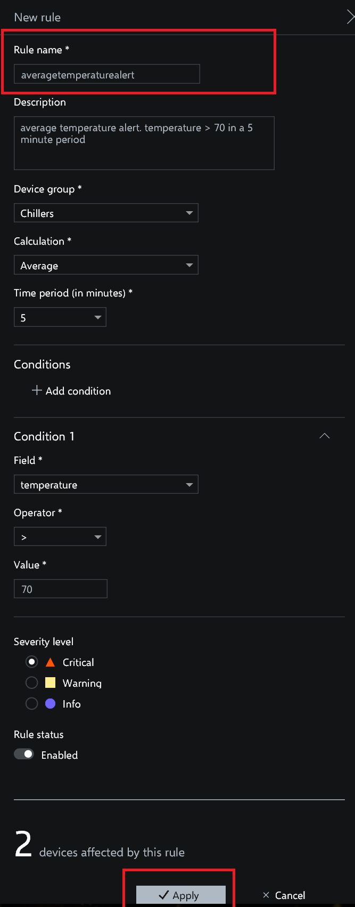

Click on **Apply** to add a new rule.

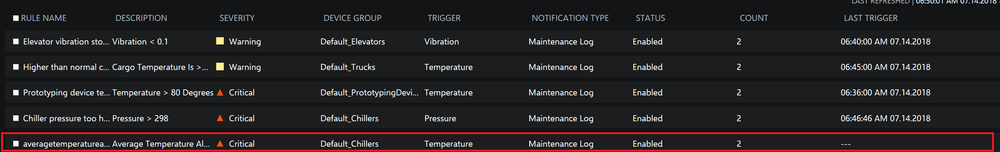

Click on **Maintenance** on the left menu and select a message and click **Acknowledge**

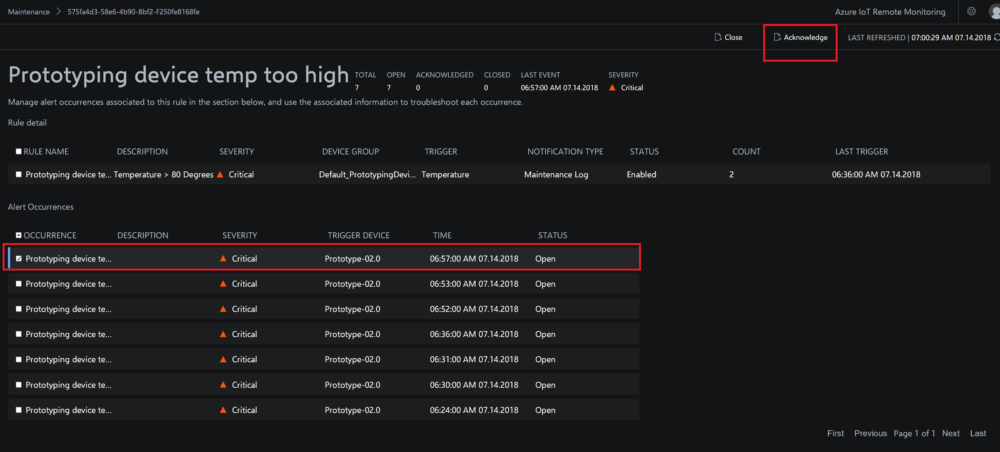

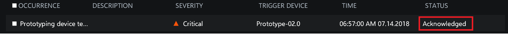

Click on **Maintenance** on the left menu and select a message and click **Closed**

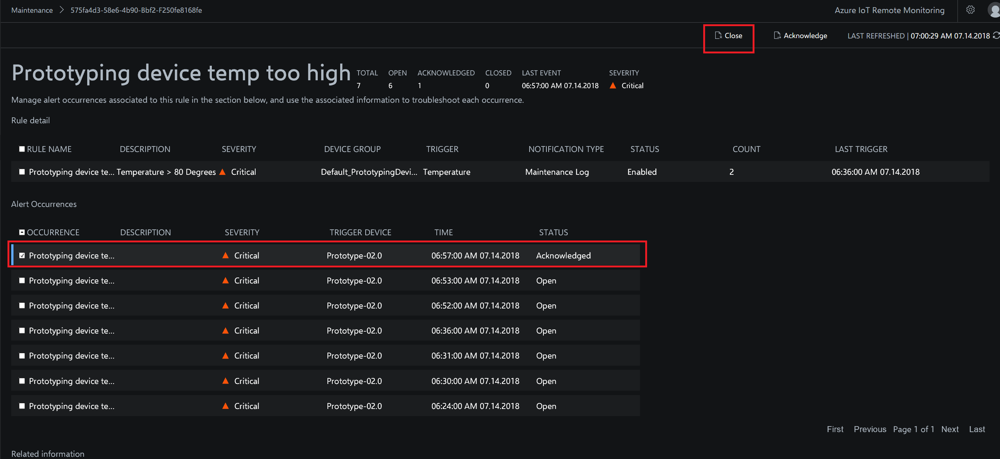

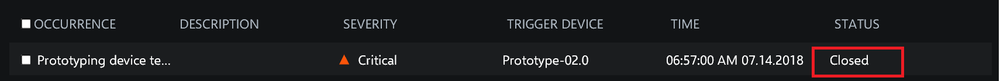

## Create Azure Time Series Insights and Visualize Device Data


## Create Time Series Insights

Azure Time Series Insights is a fully managed analytics, storage, and visualization service for managing IoT-scale time-series data in the cloud. It provides massively scalable time-series data storage and enables you to explore and analyze billions of events streaming in from all over the world in seconds. Use Time Series Insights to store and manage terabytes of time-series data, explore and visualize billions of events simultaneously, conduct root-cause analysis, and to compare multiple sites and assets.

Time Series Insights has four key jobs:

* First, it's fully integrated with cloud gateways like Azure IoT Hub and Azure Event Hubs. It easily connects to these event sources and parses JSON from messages and structures that have data in clean rows and columns. It joins metadata with telemetry and indexes your data in a columnar store.
* Second, Time Series Insights manages the storage of your data. To ensure data is always easily accessible, it stores your data in memory and SSD’s for up to 400 days. You can interactively query billions of events in seconds – on demand.
* Third, Time Series Insights provides out-of-the-box visualization via the TSI explorer. 
* Fourth, Time Series Insights provides a query service, both in the TSI explorer and by using APIs that are easy to integrate for embedding your time series data into custom applications.

<iframe src="https://channel9.msdn.com/Shows/Internet-of-Things-Show/Time-Series-Insight-for-IoT-apps/player" width="480" height="270" allowFullScreen frameBorder="0"></iframe>

In this lab you will learn

* how to set up a Time Series Insights environment
* explore
* analyze time series data of your IoT solutions or connected things


Click on **Create a Resource** and click on **Internet of Things**


Click on **Time Series Insights**


Select the resource group you previously created and click **Create** button


### Create Event Source

Create Event Source to connect to IoTHub. Please make sure you use a unique Consumer Group. Time Series Insights has a requirement to have its own unique consumer group


Select the appropriate consumer group and click Create button


### Setup Time Series Insights

Go To Time Series Insights, Click on Go To Environment which will take you to Time Series Insights Explorer

If you get Data Access Policy Error execute the following steps


Go To Environment Topology and 


Click on Add Button


Select Contributor Role


Select User


### Time Series Insights Explorer

Go To Time Series Insights Explorer


Split By ID. You will see data flowing from two devices. MXChip and Pi Simulator. 


Select humidity and Split By ID. You will see data flowing from two devices. MXChip and Pi Simulator.


Right Click to Explore events. You can download events in CSV and JSON format by clicking on **CSV or JSON** buttons


Create a perspective by clicking on the image shown below


Click **+** to add a new query


Select Temperature and split by Device ID and click on perspective image.


Create a chart by selecting a timeframe with drag feature


Create a Chart by adding a predicate


Perspective with 4 different charts and also changed Title


Click on Heatmap


View data in a table


## Cold Path Storage

### Create Data Lake Store and Stream Data from IoTHub using Azure Stream Analytics


Azure Data Lake Store is an enterprise-wide hyper-scale repository for big data analytic workloads. Azure Data Lake enables you to capture data of any size, type, and ingestion speed in one single place for operational and exploratory analytics. Data Lake Store can store trillions of files. A single file can be larger than one petabyte in size. This makes Data Lake Store ideal for storing any type of data including massive datasets like high-resolution video, genomic and seismic datasets, medical data, and data from a wide variety of industries.

## Create Azure Data Lake Store

Create a hyper scale data lake store to store IoT Data. Click on **Create a resource**


Click on **Data + Analytics**


Click on **Data Lake Store**


During creation of data lake you have the choice to encrypt the store

Data Lake Store protects your data assets and extends your on-premises security and governance controls to the cloud.

Your data is

* always encrypted
* while in motion using SSL
* at rest using service or user-managed HSM-backed keys in Azure Key Vault.

Single sign-on (SSO), multi-factor authentication, and seamless management of millions of identities is built-in through Azure Active Directory. Authorize users and groups with fine-grained POSIX-based ACLs for all data in your store and enable role-based access controls. Meet security and regulatory compliance needs by auditing every access or configuration change to the system.

Click on **Create** button


## Explore Data in Data Lake Store


### Create Folders in Data Lake Store

Create /workshop/streaming folder to store Streaming data coming from your device through IoTHub using Stream Analytics Job

Create /workshop folder


Create /workshop/streaming folder


You should have the folder structure below in place to start streaming data to data lake store


### Create Stream Analytics Job

Azure Stream Analytics is a managed event-processing engine set up real-time analytic computations on streaming data. The data can come from devices, sensors, web sites, social media feeds, applications, infrastructure systems, and more

<iframe src="https://channel9.msdn.com/Shows/Internet-of-Things-Show/Stream-Analytics-in-IoT-solutions/player" width="480" height="270" allowFullScreen frameBorder="0"></iframe>

Create a hyper scale data lake store to store IoT Data. Click on **Create a resource**


Click on **Data + Analytics**


Click on **Stream Analytics Job**


Stream Analytics job cab be created to run on the cloud as well as on the Edge. You will chose to run this on the cloud


Add Input for Streaming Job


Select IoTHub as Input


Make sure to provide a consumer group. Each consumer group allows up to 5 output sinks/consumers. Make sure you create a new consumer group for every 5 output sinks and you can create up to 32 consumer groups.


Add Data Lake Store as Output for Streaming Job


Select Data Lake Store as output sink


Select the Data Lake Store account you created in previous steps and provide folder structure to stream data to the store

/workshop/streaming/{date}/{time} with Date=YYYY/MM/DD format and Time=HH format will equate to /workshop/streaming/2018/03/30/11 on the store


You will have to Authorize data lake store connection for Stream analytics to have access to be able to write to data lake store

1. Multi-factor authentication based on OAuth2.0
2. Integration with on-premises AD for federated authentication
3. Role-based access control
4. Privileged account management
5. Application usage monitoring and rich auditing
6. Security monitoring and alerting
7. Fine-grained ACLs for AD identities


You will see a popup and once the popup closes Authorize button will be greyed out after azuthorization is complete. There are exception cases where popup doesnt appear.In this case try again in incognito mode


### Edit Stream Analytics Query

Edit Query for Streaming Job, Stream Data from IoTHub to Datalake Store


Query

```sql
SELECT
    *, System.Timestamp as time
INTO
    DatalakeStore
FROM
    IotHub
```

Save the query


Accept by pressing yes


### Start Streaming Analytics Job

Start the stream job which will read data from IoTHub and store data in Data lake Store


You can pick custom time to go back a few hours to pick up data from when your device has started streaming


Wait till job goes into running state, if you see errors could be from your query, make sure syntax is correct


### Explore Streaming Data

Go to Data Lake store data explorer and drill down to /workshop/streaming folder.You will see folders created with YYYY/MM/DD/HH format. 


You will see json files, with one file per hour, explore the data


