# DAI-DP308 Take it to the Edge!  (IoT Edge, AI, Machine Learning and Cognitive Services )

Azure IoT Edge is an Internet of Things (IoT) service that builds on top of IoT Hub. This service is meant for customers who want to analyze data on devices, a.k.a. "at the edge", instead of in the cloud. By moving parts of your workload to the edge, your devices can spend less time sending messages to the cloud and react more quickly to changes in status.

Azure IoT Edge moves cloud analytics and custom business logic to devices so that your organization can focus on business insights instead of data management. Enable your solution to truly scale by configuring your IoT software, deploying it to devices via standard containers, and monitoring it all from the cloud.

## Pre-work
>One of the steps in Milestone 3 has a deployment step that can take several minutes. It is recommended that kick it off in seperate browser tab before starting with Milestone 1. Let the operation finish in background so it's ready to go when reach Milestone 3. Here are the steps:

### Standup an AKS cluster

1. Open [https://shell.azure.com](shell.azure.com) in a new browser tab, and enter the following commands in the Bash prompt.

```
# Create resource group
az group create --name ${USER}Ready18AKSCluster --location eastus

# Create AKS cluster (this operation can take several minutes)
az aks create --resource-group ${USER}Ready18AKSCluster --name ${USER}AKSCluster --node-count 1 --generate-ssh-keys
```
*If you run into errors with duplicate resource group or cluster name replace **${USER}** in the commands above with your Microsoft alias.* 


## **Milestone 1: Standup Edge enabled VM on Azure**

For this workshop you will standup a Data Science Ubuntu VM and this VM will be the IoT Edge Device.

Go to [Github Project and click **Deploy To Azure**](
https://github.com/Azure/DataScienceVM/tree/master/Extensions/Iot
).

Fill out the custom deployment form per guidance in the figure below and click **Purchase**. 

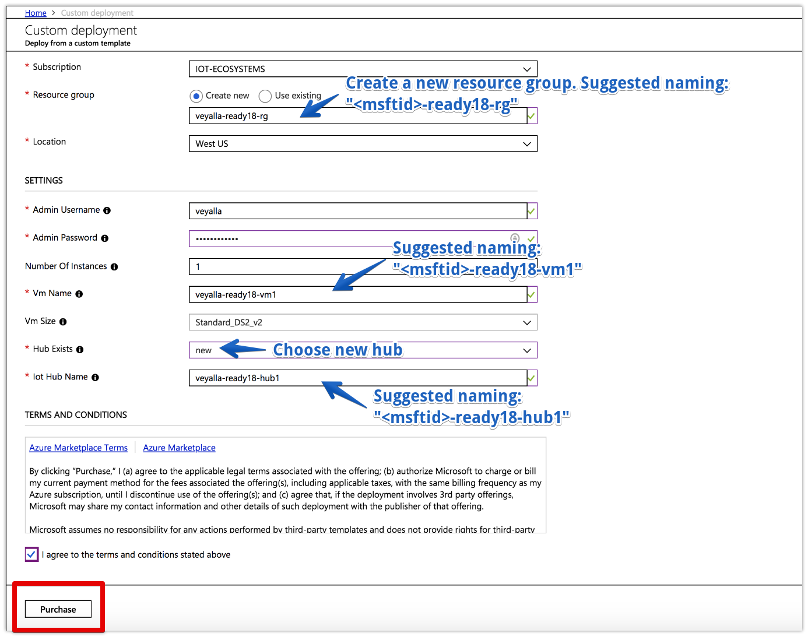

The custom deployment will complete the following operations for you:

1. Stand up an Data Science VM and IoT Hub.
2. Install the [IoT Edge runtime](https://docs.microsoft.com/en-my/azure/iot-edge/how-to-install-iot-edge-linux) and [*az* CLI](https://docs.microsoft.com/en-us/cli/azure/?view=azure-cli-latest) in the VM.
3. Open ports to allow SSH access to the Data science VM.

Once the deployment is completed, pin it to your dashboard and you will see a VM and IoT Hub resources in the tile.

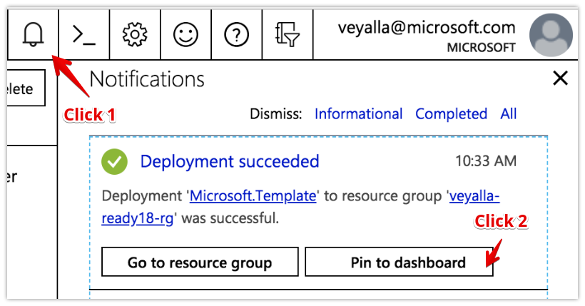

From the dashboard tile, click the "Public IP address" resource.

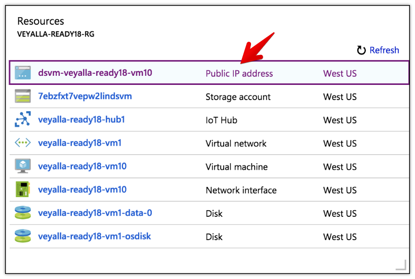

Copy the IP address from the page.

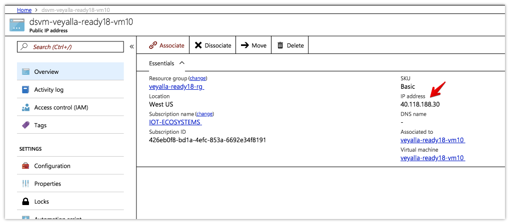

Open Cloud Shell from your Azure portal. You will SSH into the VM from here.

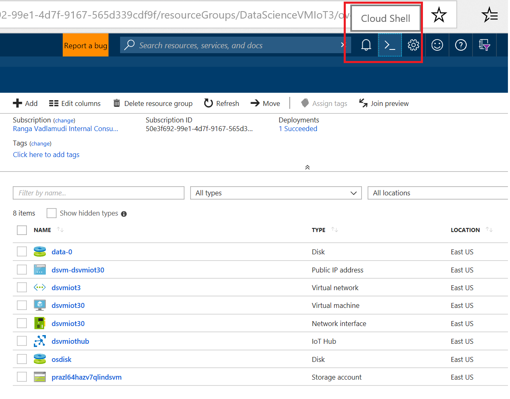

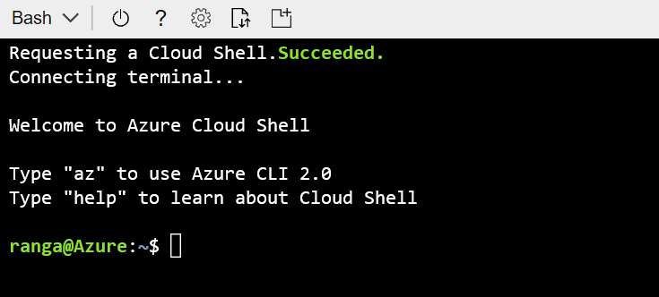

SSH into VM using copied IP address along with Username and Password you provided in the custom deployment form.

```bash
ssh <username>@<public-ip>
```

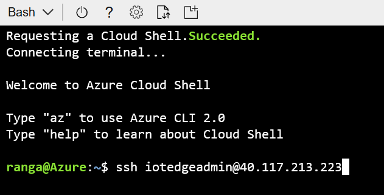

In the SSH session, cd to **IotEdge** directory and execute **edge_configure.bat**

```bash
cd /home/${USER}/IoT/IotEdge
bash edge_configure.sh
```

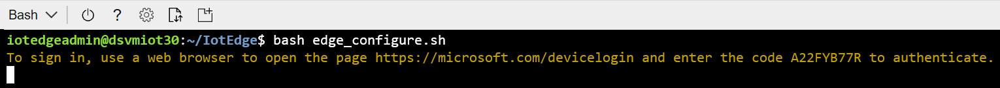

Click on the device login link and enter the displayed code in the web page.

 **edge_configure.sh** performs the following steps:

1. Creates an Edge device named "*vmhostname*_edge" in the IoT Hub using *az* CLI.
2. Associates the VM with the Edge device identity.

Run the command below and confirm the **edgeAgent** module is running.

```bash
sudo iotedge list
```

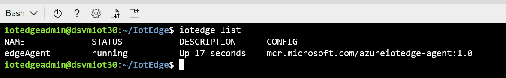

Congratulations, you have completed Milestone 1! On to the next...

## **Milestone 2: Deploy a custom module**

In this milestone, we'll deploy a simulated temperature sensor module on the Edge device. 

1. From your pinned resource group tile, go to the **IoT Hub resource** and click on the **IoT Edge** blade.
1. Click on the Edge Device ID to go to the Device details page, then click **Set Modules**.
1. From the **Deployment Modules**, click the **+Add** button, and select **IoT Edge Module**.
1. In the **IoT Edge Custom Modules** screen, enter **tempSensor** in the **Name** field and **mcr.microsoft.com/azureiotedge-simulated-temperature-sensor:1.0** in the **Image URI** field, then click **Save**.
1. Click **Next** button twice keeping default routes and **Submit** button to finish setting modules.


In about a minute, verify if temperature sensor module is deployed on the device by executing the following command in the SSH session:

```bash
sudo iotedge list
```

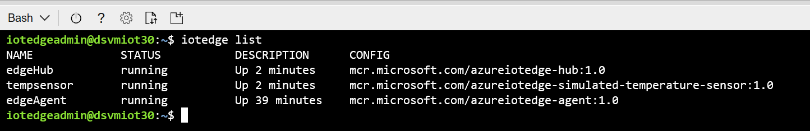

Verify data is being generated by the tempSensor module (CTRL+C will exit)

```bash
sudo iotedge logs tempSensor -f
```

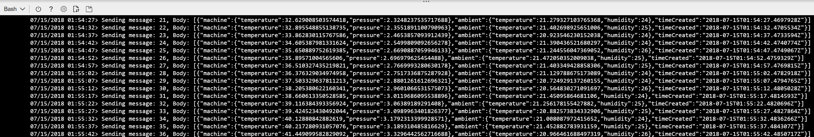

Verify data is being sent upstream to IoT Hub by checking the **IoT Hub Usage** tile in the hub's **Overview** blade.

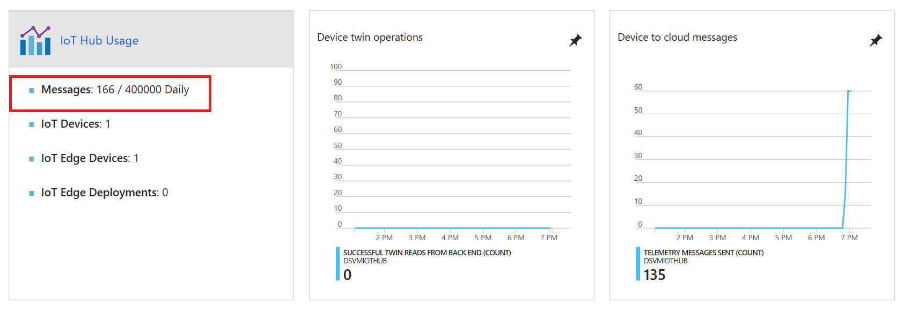

Milestone 2 complete! 

## **Milestone 3: Deploy IoT Edge AI module using Kubernetes**

### Standup an AKS cluster
>If you have completed these steps as part of the pre-work, you can move on to the next step (Verify cluster creation).

1. Open [https://shell.azure.com](shell.azure.com) in a new browser tab, and enter the following commands in the Bash prompt.

```
# Create resource group
az group create --name ${USER}Ready18AKSCluster --location eastus

# Create AKS cluster (this operation can take several minutes)
az aks create --resource-group ${USER}Ready18AKSCluster --name ${USER}AKSCluster --node-count 1 --generate-ssh-keys
```
*If you run into errors with duplicate resource group or cluster name replace **${USER}** in the commands below with your Microsoft alias.* 

### Verify cluster creation

First, let's connect to the cluster

```
az aks get-credentials --resource-group ${USER}Ready18AKSCluster --name ${USER}AKSCluster 
```

We'll use the **kubectl** command line tool to interact with the AKS cluster. Check the nodes in the cluster using:

```
kubectl get nodes
```

Output should like this (the nodes names in your cluster will be different):

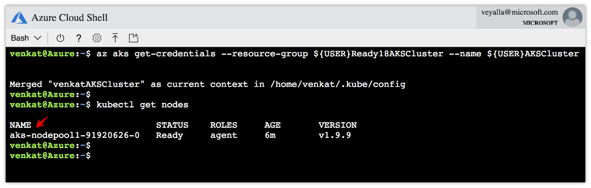


### Install the IoT Edge Kuberentes connector

1. Clone the IoT Edge connector repo.
    ```
    git clone https://github.com/Azure/iot-edge-virtual-kubelet-provider.git
    ```

2. Initialize Helm, a Kubernetes package manager.
    ```
    helm init
    ```

3. Get the IoT Hub Owner Connection String for the IoT Hub you created in the previous milestones.

    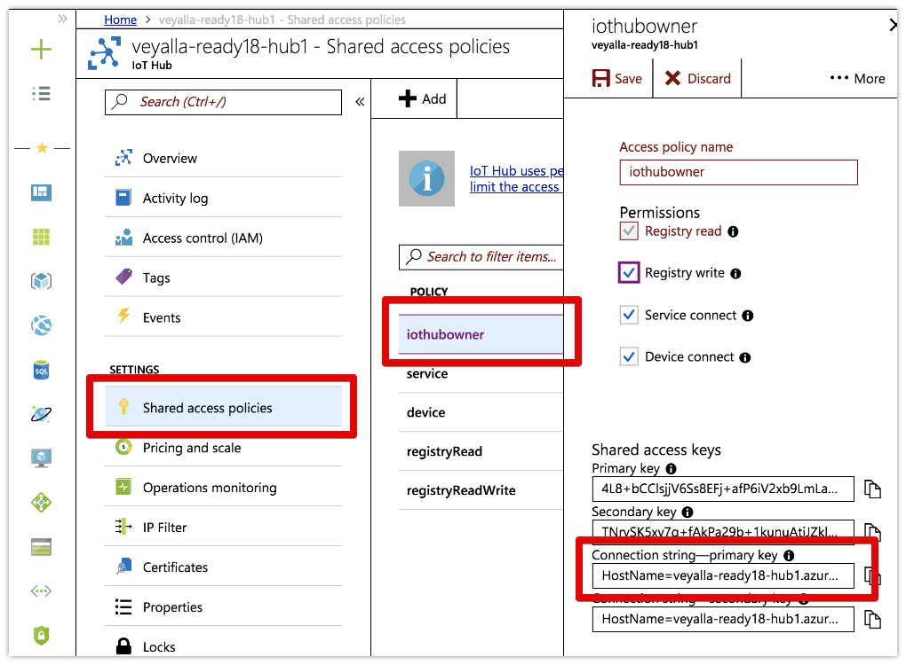

4. Save the Owner connection string in key called **hub0-cs** in a Kubernetes secret store called **my-secrets**.

    ```
    kubectl create secret generic my-secrets --from-literal=hub0-cs='replace-with-copied-owner-connection-string'
    ```

5. Give cluster-admin privileges to default account.

   ```
   kubectl create clusterrolebinding add-on-cluster-admin --clusterrole=cluster-admin --serviceaccount=kube-system:default
   ```

5. Install the IoT Edge connector using helm.

    ```
    cd iot-edge-virtual-kubelet-provider/src/
    helm install -n hub0 --set rbac.install=true charts/iot-edge-connector/
    ```

    In a minute, `kubectl get nodes` will show the IoT Edge connector as a virtual node.

    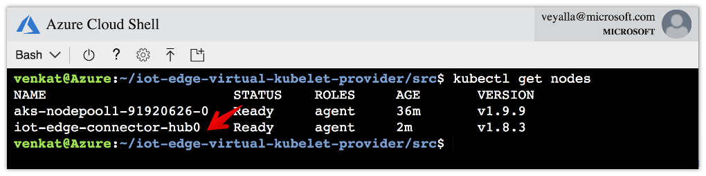


### Create a Kubernetes deployment for IoT Edge Connector
The IoT Edge Kubernetes connector allows expressing IoT Edge module deployment as a first-class Kubernetes deployment. It does so by consuming Kubernetes deployments and translating them to IoT Hub deployments for its backing IoT Hub.

1. Add a tag to the Edge device to make it targetable by the deployment.

    From Edge device details, click the **Device Twin** button from the top bar and add the following json.

    ```
    "tags": {
        "location": "b43"
    },
    ```
    

2. Create the Kubernetes deployment that targets this device.

    ```
    curl -fsSL aka.ms/k8s-fruity-ai-edge | kubectl apply -f -
    ```


    Here is the full content of the deployment:
    <script src="https://gist.github.com/veyalla/2de3e39f4bd811af8f07b2ed81d9032d.js"></script>


3. In the Azure portal you should see the **fruity-ai** deployment show in the **IoT Edge Deployments** list. And, shortly the deployment will be applied to the Edge device since it is tagged with value that the deployment is targetting.

    If you don't see the deployment, hit the **Refresh** button every 30 secs or so to update the list.

    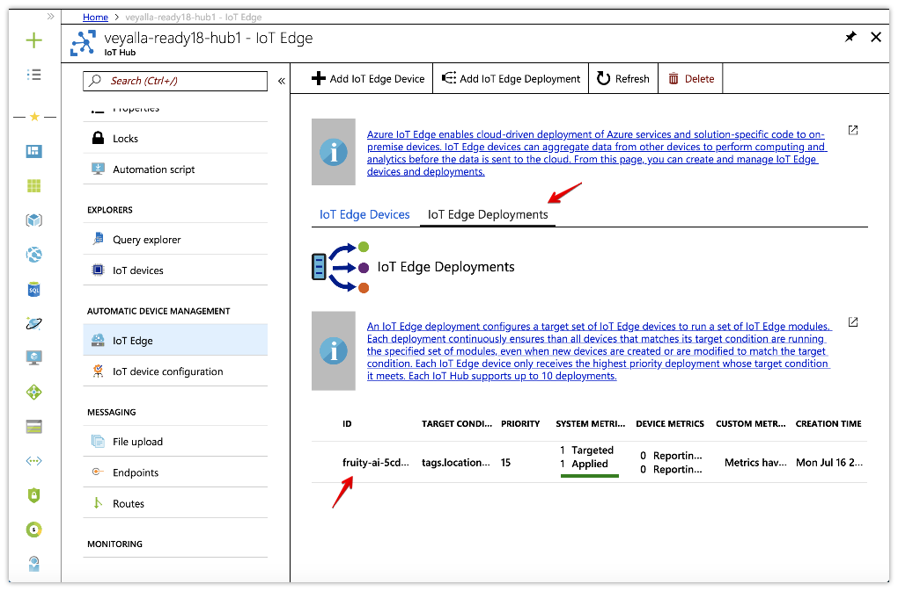


4. The change in configuration will also be reflected on the VM you created in Milestone 1. List the modules in the SSH session.

    ```bash
    sudo iotedge list
    ```

    >If the Bash cloud shell times out or becomes unreponsive, click the *power* button on the top bar of the cloud shell window to reconnect. Progress is saved, but you will need to SSH in to the Edge VM again.

    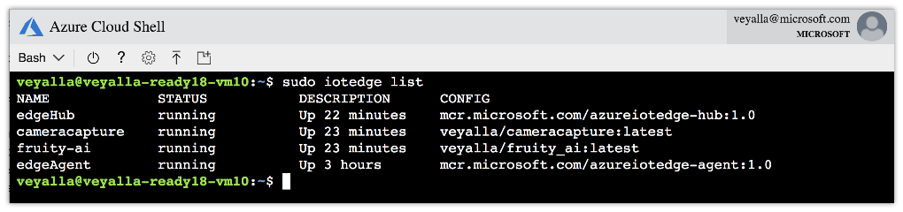

5. You can view the results of the realtime object recognition using:

    ```
    watch -n 0.2 sudo iotedge logs --tail 1 cameracapture
    ```

    CTRL+c will exit.

Milestone 3 complete!

## **Milestone 4: At scale deployments with Kubernetes**
The power of Kubernetes becomes clear when doing at-scale deployments. Consider a common scenario - you have multiple IoT Hub all over the world and want the same *fruity-ai* configuration on all of them. With Kubernetes this is literally a one command operation! Let's see how.

1. Create a new IoT Hub and VM Edge device following steps in Milestone 1.

2. Add the same tag to edge device as in Milestone 3.

2. Create a new secrets store **my-secrets1** and save the Owner connection string for the new hub in **hub1-cs**.

    >Enter the below commands in the cloud shell window, **not** in the VM's SSH session.

    ```
    kubectl create secret generic my-secrets1 --from-literal=hub1-cs='replace-with-2nd-hub-owner-connection-string'
    ```

3. Create a file called **values.yaml** with the following content.

    ```
    edgeproviderimage:
      repository: microsoft/iot-edge-vk-provider
      tag: latest
      pullPolicy: Always
      port: 5000
      secretsStoreName: my-secrets1
      secretKey: hub1-cs
    vkimage:
      repository: microsoft/virtual-kubelet
      tag: 0.3
      pullPolicy: Always
    env:
      nodeName: iot-edge-connector-hub1
      nodeTaint:
    # Install Default RBAC roles and bindings
    rbac:
      install: false
      serviceAccountName: virtual-kubelet
      # RBAC api version (currently v1)
      apiVersion: v1
      # Cluster role reference
      roleRef: cluster-admin
    ```
4. Use Helm to install another IoT Edge connector virtual node that is backed by the 2nd IoT Hub by pointing it to the file created in the previous step.

    ```
    helm install -n hub1 --set rbac.install=true /home/${USER}/iot-edge-virtual-kubelet-provider/src/charts/iot-edge-connector/ -f ./values.yaml
    ```

    In a few seconds, `kubectl get nodes` will show the new virtual node.

    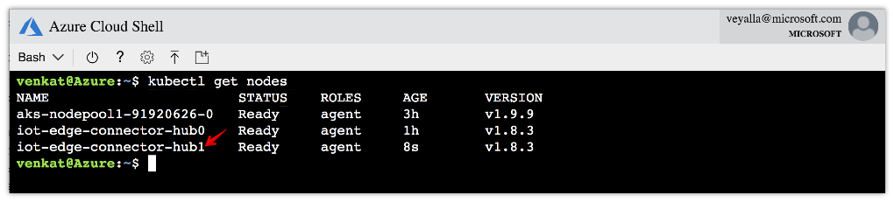


5. Scale the deployment to two replicas of the deployment specification. The second replica will be scheduled on the new virtual node and sent to the backing 2nd IoT hub.

    ```
    kubectl scale deployment fruity-ai --replicas=2
    ```

    You should now see the new deployment show up in the 2nd hub, and get applied to the device in it.

Any updates to the deployment from Kubernetes will now reflect in both IoT hubs, allowing you to manage devices at scale.

If you've made it till here, you're awesome! Check out the additional resources for more information.

## Additional resources:
* [Azure IoT Edge documentation](https://docs.microsoft.com/en-us/azure/iot-edge/about-iot-edge)
* [IoT Edge Github repo](https://github.com/azure/iotedge)
* [IoT Edge integration with Kubernetes](https://azure.microsoft.com/en-us/blog/manage-azure-iot-edge-deployments-with-kubernetes/)

* Kubernetes integration Channel 9 video:
    <iframe src="https://channel9.msdn.com/Shows/Internet-of-Things-Show/Kubernetes-integration-with-Azure-IoT-Edge/player" width="480" height="270" allowFullScreen frameBorder="0"></iframe>

* [IoT Edge custom vision sample](https://azure.microsoft.com/en-us/resources/samples/custom-vision-service-iot-edge-raspberry-pi/)

* [Cognitive services customvision.ai](https://customvision.ai/)


