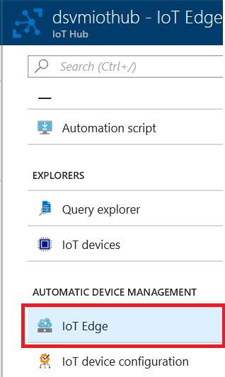
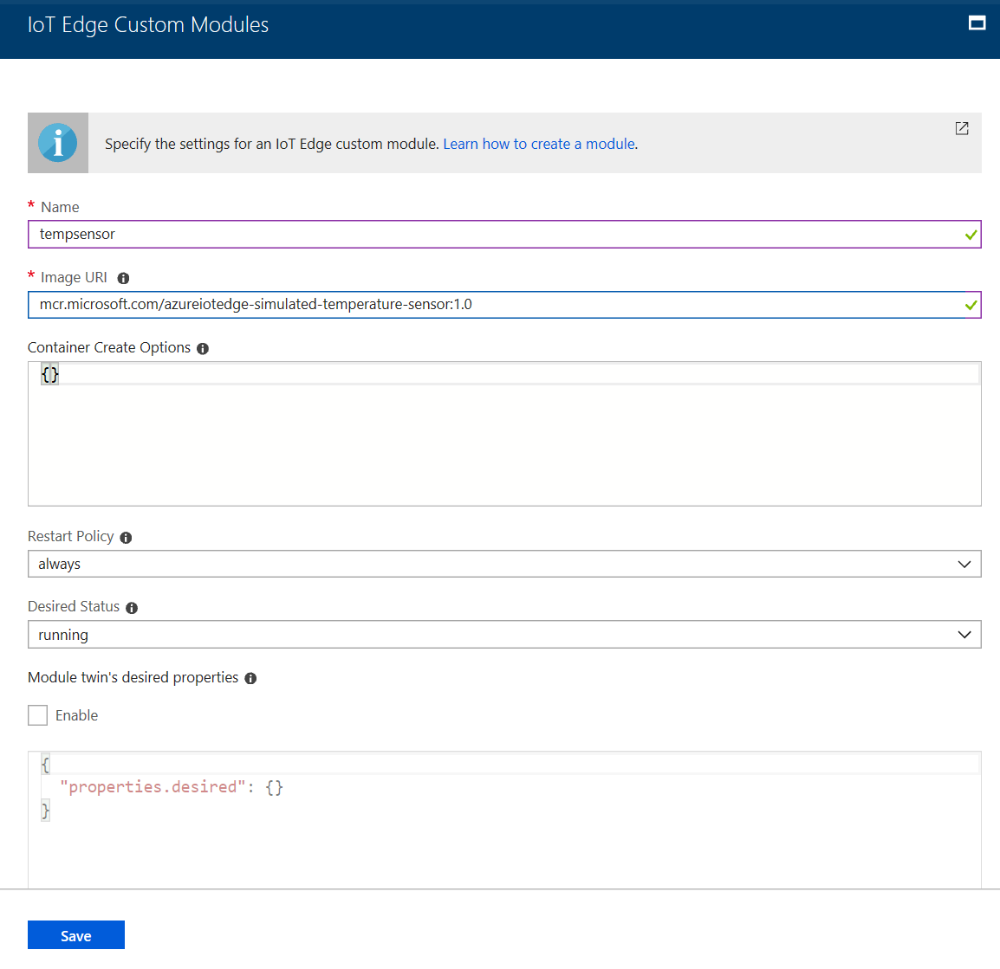
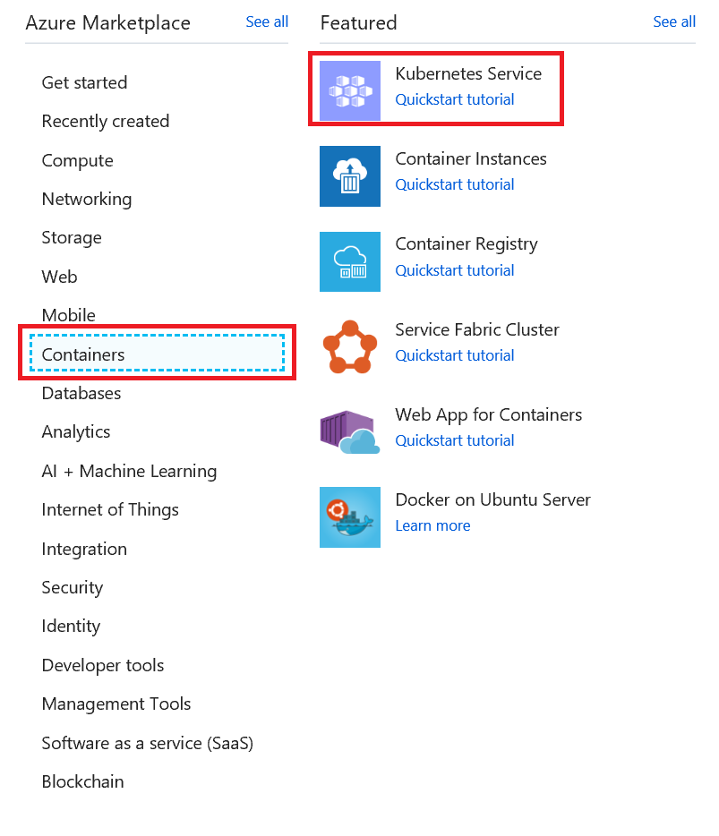
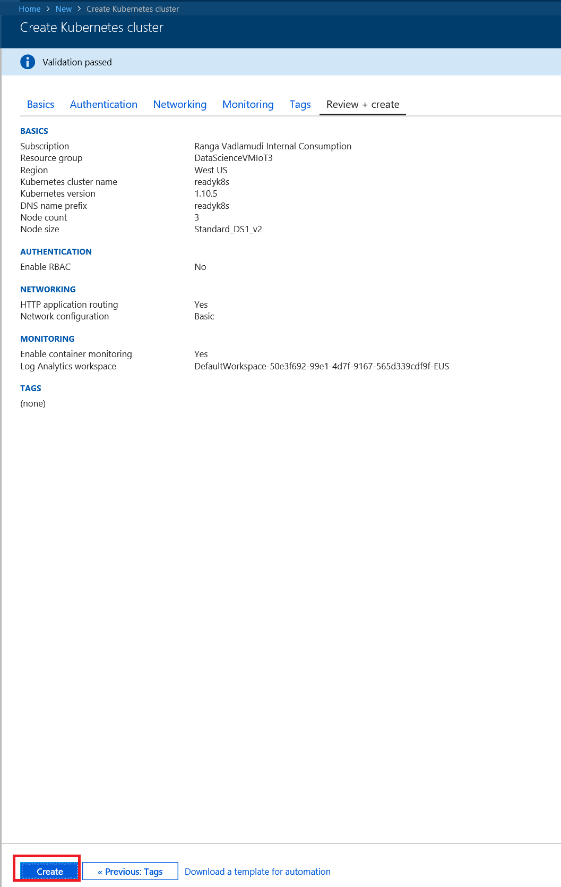
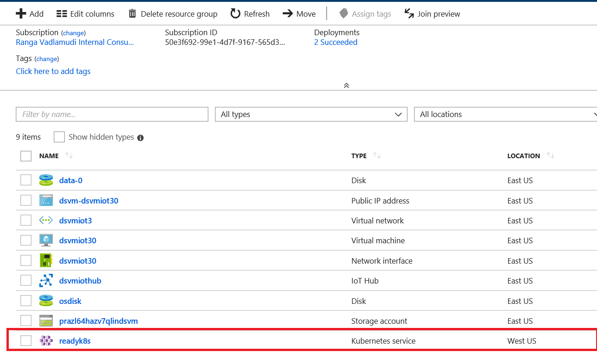

# DAI-DP308 Take it to the Edge!  (IoT Edge, AI, Machine Learning and Cognitive Services )

Azure IoT Edge is an Internet of Things (IoT) service that builds on top of IoT Hub. This service is meant for customers who want to analyze data on devices, a.k.a. "at the edge", instead of in the cloud. By moving parts of your workload to the edge, your devices can spend less time sending messages to the cloud and react more quickly to changes in status.

Azure IoT Edge moves cloud analytics and custom business logic to devices so that your organization can focus on business insights instead of data management. Enable your solution to truly scale by configuring your IoT software, deploying it to devices via standard containers, and monitoring it all from the cloud.

<iframe src="https://channel9.msdn.com/Shows/Internet-of-Things-Show/Kubernetes-integration-with-Azure-IoT-Edge/player" width="480" height="270" allowFullScreen frameBorder="0"></iframe>

## Milestone 1: Standup Edge enabled VM on Azure

For this workshop you will standup Data Science Ubuntu VM and this VM will be the IoT Edge Device.

Go to [Github Project and click **Deploy To Azure**](
https://github.com/Azure/DataScienceVM/tree/master/Extensions/Iot
). This will install a Data Science VM which is IoT Edge enabled.

Fill out the custom deployment form per guidance in the figure below and click **Purchase**. 


The custom deployment will complete the following operations for you:

1. Stand up an Data Science VM and IoT Hub.
2. Install the [IoT Edge runtime](https://docs.microsoft.com/en-my/azure/iot-edge/how-to-install-iot-edge-linux) and [*az* CLI](https://docs.microsoft.com/en-us/cli/azure/?view=azure-cli-latest) in the VM.
3. Open ports to allow SSH access to the Data science VM.

Once the deployment is completed, pin it to your dashboard and you will see a VM and IoT Hub resources in the tile.


From the dashboard tile, click the "Public IP address" resource.


Copy the IP address from the page.


Open Cloud Shell from your Azure portal. You will SSH into the VM from here.


SSH into VM using copied IP address along with Username and Password you provided in the custom deployment form.

```bash
ssh <username>@<public-ip>
```


*If you use only one Azure subsciption, you can ignore this step.* Otherwise, ensure your subscription is set to the one where the VM and IoT Hub were deployed.

 ```bash
 az login --use-device-code
 az account set -s "replace-with-subscription-name-used-for-vm-and-iothub"
 ```
 >The commands above, if needed, should be run in SSH session of the VM, **not** in the default cloud shell environment.

In the SSH session, cd to **IotEdge** directory and execute **edge_configure.bat**

```bash
cd /home/${USER}/IotEdge
bash edge_configure.sh
```


Click on the device login link and enter the displayed code in the web page.

 **edge_configure.sh** performs the following steps:

1. Creates an Edge device named "*vmhostname*_edge" in the IoT Hub using *az* CLI.
2. Associates the VM with the Edge device identity.

Run the command below and confirm the **edgeAgent** module is running.

```bash
sudo iotedge list
```


Congratulations, you have completed Milestone 1! On to the next...

## Milestone 2: Deploy a custom module

In this milestone, we'll deploy a simulated temperature sensor module on the Edge device. From your pinned resource group tile, go to the IoT Hub resource and click on the **IoT Edge** blade.






Click **Next** twice and **Submit**

Verify if temperature sensor module is deployed on the device


Verify if data is being generated and sentemp sensor module is deployed

```
$ docker logs -f tempsensor
```


Verify data is being sent upstream to Iot Hub


### Create Azure Kubernetes Service

Click on Create a resource


Click on **Containers** and **Kubernetes Service**



Create Kubernetes service in the existing resource group with 3 VMs. Click **Review+Create**


Review the deployment and click **Create**



Kubernetes cluster is created in a few minutes



Run the following command in **cloud shell** to get credentials

```code
az acs kubernetes get-credentials --resource-group=<cluster-resource-group> --name=<cluster-name>
```

Test Kubectl

Run
```code
$ kubectl get pods
```